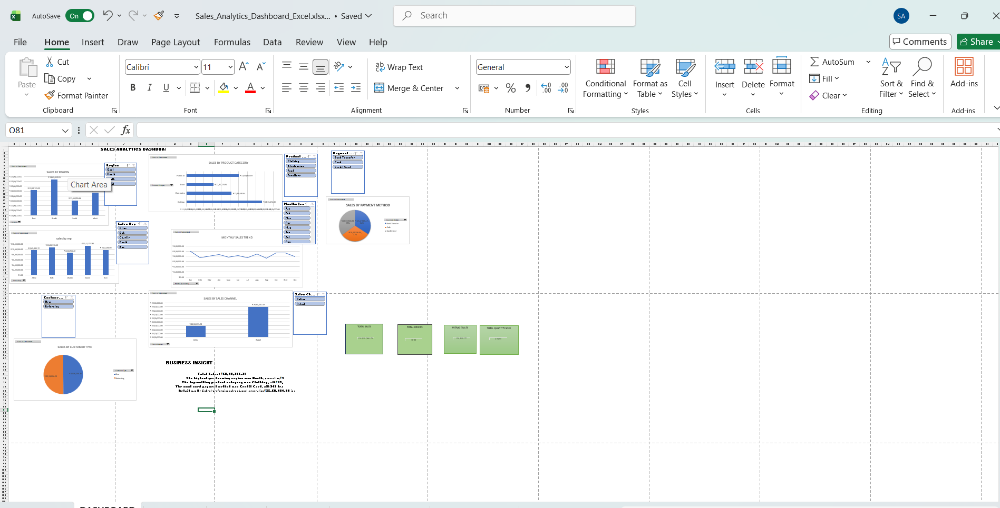

# Sales Analytics Dashboard (Excel)

## Project Overview
An interactive Sales Analytics Dashboard built using Microsoft Excel to analyze 1,000 sales records.

## Tools Used
- Microsoft Excel
- Pivot Tables
- Pivot Charts
- Slicers
- KPI Cards

## Dashboard Features
- Total Sales KPI
- Total Orders KPI
- Average Sales KPI
- Total Quantity Sold KPI
- Monthly Sales Trend
- Sales by Region
- Sales by Sales Representative
- Sales by Product Category
- Sales by Payment Method
- Sales by Sales Channel
- Sales by Customer Type

## Business Insights
- Total Sales: ₹50,19,265.23
- Total Orders: 1,000
- Highest Performing Region: North
- Top Product Category: Clothing
- Most Used Payment Method: Credit Card
- Highest Sales Channel: Retail

## Dashboard Preview

